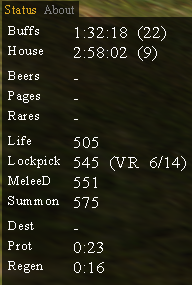

# Oracle Of Dereth

An [Asheron's Call](https://emulator.ac/how-to-play/) [Decal](https://decaldev.com/) v2.9.8.3 plugin that builds against .NET Framework 4.8 and uses VirindiViewService.

## Getting Started
- This plugin requires the latest Decal, v2.9.8.3. It will fail to register in previous versions.

- Download and run the latest OracleOfDerethInstaller.exe from the [Oracle of Dereth Releases](https://github.com/advis61/OracleOfDereth/releases) page.

- It should now appear in the Decal list of plugins. You're all done!

## Usage

This plugin is just a HUD with no configuration available.

It will:

- Display the time remaining on your Buffs, House Buffs, Beers, Pages and Rares.
- Display your current Lockpick, Life, MeleeD and Summon skill.
- Display how many Viridian Essences are required to complete a Viridian Rise level at your current lockpick skill.
- Display your Destruction, Protection and Regen aetheria procs.

Type `/ood` to print the version number.

## License

MIT

## Contact

Please reach out to Advis Eveldan on the [Levistras Discord](https://discord.gg/VwbWHskR) with any feedback or bugs