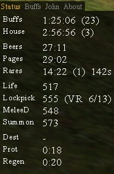
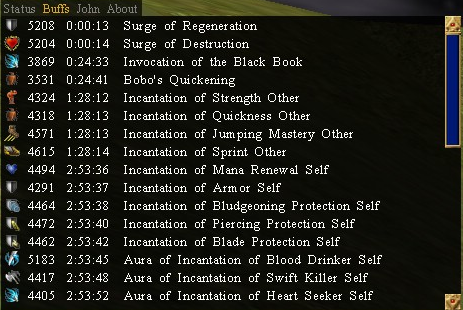
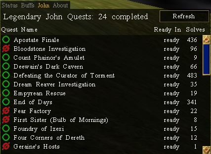
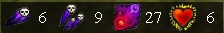

# Oracle Of Dereth

Download the latest version: [Download Oracle of Dereth](https://github.com/advis61/OracleOfDereth/releases/download/1.4.5/OracleOfDerethInstaller-1.4.5.0.exe)

If you crash at the login screen, make sure to upgrade to latest Decal v2.9.8.3

## About

An [Asheron's Call](https://emulator.ac/how-to-play/) [Decal](https://decaldev.com/) v2.9.8.3 plugin.

Status HUD

Buffs List

John Tracker

Void Target View

## Getting Started
- This plugin requires the latest Decal, v2.9.8.3. It will fail to register in previous versions.

- Download the latest .exe from above. Or check out all [Oracle of Dereth Releases](https://github.com/advis61/OracleOfDereth/releases).

- Run the .exe program.

- If the "Windows protected your PC" message appears, click on More info near the top-left corner of the window and select Run anyway.

- Complete the installer.

- It should automatically appear in the Decal list of plugins. You're all done!

## Usage

There are 4 main areas: the Status HUD, Buffs List, John Tracker and Void Target View.

### Status HUD

The HUD displays at a glance buff timers and skill level information.

This screen cannot be configured.

It will:

- Display the time remaining on your Buffs, House Buffs, Beers, Pages and Rares.
- Display your current Lockpick, Life, MeleeD and Summon skill.
- Display how many Viridian Essences are required to complete a Viridian Rise level at your current lockpick skill.
- Display your Destruction, Protection and Regen aetheria procs.

### Buffs List

Displays your buffs and debuffs with time remaining.

### John Tracker

Displays how many legendary quests you've completed in this round of a [John](https://acportalstorm.com/wiki/John) 30 [Legendary Quests](https://acportalstorm.com/wiki/Legendary_Quests) cycle.

- A green icon means the quest has already been completed in the current John cycle. It's already counted towards your total.
- A red icon means the quest is available. Completing it will bring you 1 step closer to your goal of 30.

Displayed as well is each quest's individual quest timer and number of solves.

Click the quest icon to /think the wiki url to yourself, and copy it to the Windows clipboard.
Click the quest name to /think some handy quest notes to yourself. Use alongside GoArrow to always known the next step.

Click the Refresh button will run /myquests and refresh the quest data.

### Void Target View

Only visible for characters with Void Magic.

Intended to work alongside the amazing [Target HUD](https://www.accpp.net/archive/922b4feec61670a97ef5b965092c709d) plugin (no affiliation).

Displays a target view that tracks your Corruption, Corrosion and Destructive Curse spells on each target. As well as your destruction aetheria proc.

It only tracks your own void spells, and will not display other void mage's spells.

The Corruption blast spell is tracked on 1 target only and is not aware of any splash damage targets.

If your dot was cast with the destruction proc up, it will be displayed in gold color.

### Commands

Type `/ood` to print the version number.

Type `/myquests` to manually refresh the John tracker.

## Technicals

This plugin builds against .NET Framework 4.8 and uses VirindiViewService.

## License

MIT

## Contact

Please reach out to Advis Eveldan on the [Levistras Discord](https://discord.gg/VwbWHskR) with any feedback or bugs