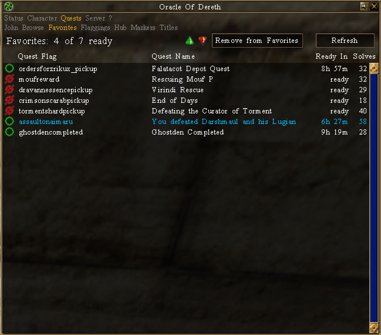
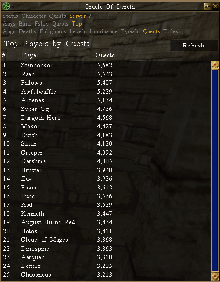
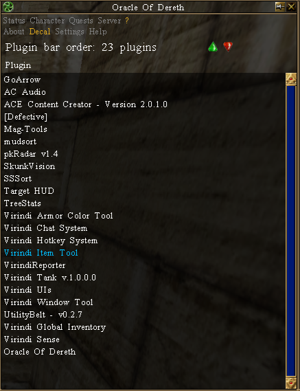

# Oracle Of Dereth

An [Asheron's Call](https://emulator.ac/how-to-play/) [Decal](https://decaldev.com/) plugin.

Download the latest version: [Download Oracle of Dereth](https://github.com/advis61/OracleOfDereth/releases/download/2.1.1/OracleOfDerethInstaller-2.1.1.0.exe)

To upgrade from a previous version, just download and re-run the .exe file.

## Getting Started
- This plugin requires the latest [Decal](https://www.decaldev.com/), v2.9.8.3

- Download the latest .exe from above.

- Run the .exe program.

- If the `Windows protected your PC` message appears, click on `More info` near the top-left corner of the window and select `Run anyway`.

- Complete the installer.

- It will automatically appear in the Decal list of plugins. You're all done!

- If the game crashes at the login screen, make sure to upgrade to latest Decal v2.9.8.3

## Features

Void Target View

Trade Browser

Status HUD

Buffs

Nearby

Fellowship

Items

Augmentations

Cantrips

Credits

Luminance

Recalls

Society

Quest Flags

Favorites

John Tracker

Exploration Markers

Facility Hub

Flagging quests

Titles

Summon Score

Weapon Score

Conquest Augs

Bank

Fship List

Top Players

Decal plugins

## Quest Catalog

Oracle of Dereth uses a curator-maintained [master quest list](https://github.com/advis61/OracleOfDereth/blob/master/OracleOfDereth/Resources/quests.csv) to connect your character's quest flags with known quests. The Verified filter displays quest flags that were discovered by other players on your server.

The plugin checks for a new master list once per day, downloads it in the background and reloads it automatically. This can be disabled with the `Check For Quest Updates` setting. A bundled copy is always available if the downloaded list is missing or invalid or if you're playing Asheron's Call without internet.

The plugin also discovers flags reported by `/myquests` and `/myqstlist` that are new or not yet verified for the current server. Click `Send` to contribute your quest flags to Oracle of Dereth on Discord for review.

## Quest Directions and Wiki URLs

Click on a row's quest name to think the directions to yourself. Or the completed/uncompleted icon to think the wiki URL.

These actions will copy to windows clipboard by default. This can be disabled on the settings screen.

Hold CTRL + click to output to /cg

Hold ALT + click to output to /a

Hold SHIFT + click to output to /f

## Delete other players' summons and pets

Deletes from your game world other players' summons and pets.

Enable `Delete Other Players' Summons` in Settings, or use `/od deletesummons on`.

Enable `Delete Other Players' Pets` in Settings, or use `/od deletepets on`.

## Screenshots

Take a screenshot with `/od screenshot` and the filepath will be copied to the windows clipboard.

Use `/od vistashot` to take a screenshot with all UI hidden.

You can also bind **OracleDereth → Screenshot** and **OracleDereth → Vistashot** in Virindi Hotkey System. No keys are assigned by default.

## Details

This plugin does a lot.

### Status HUD

The HUD displays at a glance buff timers and skill level information.

This screen cannot be configured.

It will:

- Display the time remaining on your Buffs, House Buffs, Beers, Pages and Rares.
- Display your current Lockpick, Life, MeleeD and Summon skill.
- Display how many Viridian Essences are required to complete a Viridian Rise level at your current lockpick skill.
- Display your Destruction, Protection and Regen aetheria procs.

### Buffs List

Displays your buffs and debuffs with time remaining.

### Nearby List

- Displays all nearby WorldObjects, grouped by name. 
- Click to select the closest one.
- Sort by default (objectclass), name or distance.

### Fellowship

- Create a fellowship in one click with a fantasy sounding name
- AutoRecruit will send a fellowship recruit to any players in range
- Pauses around lifestones and bindstones.

### Items

- Add selected items to list.
- Add all character items to list.
- Sort by name, info, details, spells.
- Export to clipboard, text, csv and json

### Server Inventory (VGI)

- Open **Server → Inventory** to browse VGI's saved items for every character on your current server.
- **Set VGI Track All Items** defaults to **Yes** in Oracle's settings. It automatically enables **Track All Items** in VGI after each character logs in. Set it to **No** to stop automatic setup; this does not turn off tracking already saved in VGI. The DLL integration supports VGI 1.0.0.8 and 1.0.0.9 and leaves VGI optional.
- Oracle confirms that the DLL request changes VGI's active tracking mode, with a database fallback if it cannot confirm within ten seconds. It also saves **Track All Items** for every known character on the current server, enrolling untracked characters from VGI's character records. Other characters pick up the setting on their next login; a chat message asks the current character to relog if immediate activation was unavailable. Database updates are verified in a transaction and retry briefly if VGI is busy or still initializing.
- Uses the same item summaries, search, category checkboxes, Doubles filter, and sorting as Items, with a sortable Character column. Search also matches character names.
- Plain text searches match all words anywhere in the row: `CD2 legendary frost`. Quoted phrases must occur within one column: `"Weapons Eveldan" "Bludgeon Ward"`. Quotes can be combined with ordinary terms or regex.
- In plain searches, `legendary`, `epic`, `major`, and `minor` automatically pair with the next word as a phrase: `Advis Legendary Bludgeoning` means `Advis "Legendary Bludgeoning"`. A tier at the end stays a standalone term; explicit quotes and regex retain their own behavior.
- Regex syntax is detected automatically for expressions such as `legendary.*legendary`, `legendary (frost|flame|acid)`, `legendary frost.*legendary acid`, `legendary (frost|flame|acid).+adept`, and `legendary acid.*Adept`. Regex searches are case-insensitive and follow name, type, spells, set/effect, info/ratings, then character order. Use rating labels such as `legendary.*CD2`; `+N` is not a rating alias. Within spells, regex order follows the displayed spell order. The existing `legendary*2` shorthand also works. Invalid or overly slow regex shows a search error with an empty result list in VGI.
- The subfilter row follows the most recently enabled category. Weapons offers HW (Heavy), FW (Finesse), LW (Light), 2H (Two Handed), War, Void, TW (Thrown), Bow, and Xbow (Crossbow). Multiple selections are alternatives; none means all weapons. Switching categories preserves subfilter selections, and Reset clears them.
- Weapon elements appear on the right: Slash, Pierce, Bludge, Fire, Frost, Storm, Acid, and Nether. They search the Type summary, including Fire/Flame, Frost/Cold, Storm/Lightning, and Nether/Void aliases. Elements combine with weapon types; multiple elements match any selected value.
- Searches scan the current server and display the best **5,000 matches** for the selected sort. The count includes matches beyond the limit; narrow your filters to find specific items. Clipboard and Text/CSV/JSON exports include the displayed results, up to 5,000 items.
- CSV and JSON share the same fields, including unsigned numeric Item ID, Material, Element, Quantity, Uses Remaining, and Keys Held. Numeric Workmanship replaces the formatted Craft column and preserves fractional salvage workmanship. New numeric fields are numbers in JSON; unavailable quantities/uses/workmanship are blank in CSV and null in JSON. Rating headers remain D, DR, C, CR, CD, CDR, HB, and V.
- Text exports, inventory clipboard descriptions, and saved-item chat descriptions end with `(Last on Character)` when an owner is known.
- Changing filters or sorting reruns the search; typing waits briefly before searching. Starting a search releases the previous results. Scans run in short steps, and a newer search cancels the previous one.
- Inventory loads automatically when opened. After the tab or window has been hidden for 30 seconds, item data and displayed rows are released to save memory. Returning automatically reruns the search with the same text, filters, and sorting, and restores the highlighted item when it still matches. Brief tab switches keep completed results.
- Searches reread the saved database. Offline characters reflect their last VGI scan; this does not request identification or modify VGI's data.
- Click a row to print its saved description. Copy, Text, CSV, and JSON use the filtered list and include character ownership.
- Changing a filter or selecting an item reveals **Save Search**. It saves the text, all filters and subfilters, sorting, and the selected item (optional). Other characters on the same server see **Load Search** when viewing **Server > Inventory**; polling runs only on that tab, on even-numbered seconds. Loading restores the search, highlights the saved item if present, and selects it in game when it is still in that character's inventory, then moves the full item or stack to the first slot of the main pack without merging. The save is consumed once and the button disappears until you edit the search or select an item again.
- There is one pending search per server; saving again replaces it. Clients under the same Windows user share a small file in `Documents\Decal Plugins\Oracle of Dereth\saved-inventory-search`. Loading reads and deletes it under a shared lock, so only one client can consume it. No request list or additional polling timer is used.
- VGI is optional. Without its database, continue using the existing Items tab to add and identify items.
- Equipped snapshots do not show OD/OA/OM because VGI does not save the active-buff list needed to resolve their overages reliably.

### XP Augmentations

- Displays your character's Blank Augmentation Gem quest timers
- Displays your character's XP Augmentations

- A green icon means you've achieved this augmentation.
- A red icon means you haven't yet earned this augmentation.

### Luminance Augmentations

Displays your character's Luminance Augmentations
Displays amount of luminance spent, remaining, and % to max.

### Recall Spells

Displays your known recall spells.

### Cantrips List

- Displays minor / moderate / epic / legendary for every cantrip. 
- Displays suit set bonuses.
- Displays Essence Glutton and Warrior's Vitality
- Displays a (2) or more if you have more than 1 of the same cantrip equipped.

Only displays cantrips for skills that you have known.

### Quest Flags

Displays your /myquests cross-referenced with every quest flag the plugin knows about, in one searchable list — the raw database behind the curated tabs below.

- A green icon means your character holds that flag. A red icon means it has never been completed.
- Ready In shows `completed` for a one-time quest, or the remaining cooldown for a repeatable one.
- Filter by flag or quest name, and narrow by Completed / Incomplete, One Time / Repeatable, Server or New.
- New means the server reported a flag that isn't in the plugin's master list yet. Please send those along to Advis Eveldan so they can be added.

Click the quest icon to /think the wiki url to yourself. Click the flag or name for its quest notes. Click Ready In or Solves to print the raw quest flag data to chat.

Click any column header to sort by it; click again to reverse.

The Copy / Text / CSV / JSON buttons export whatever the filter is currently showing.

Click Add to Favorites to add to the Favorites list. Click Send to send your quest flags to Advis Eveldan to add to the master list.

Unlike the hand-curated lists elsewhere in the plugin, this one was assembled with AI assistance and may contain errors.

### Favorites

Set up your own list of quests. Set order with up or down arrows.

### John Tracker

Displays how many legendary quests you've completed in this round of a [John](https://acportalstorm.com/wiki/John) 30 [Legendary Quests](https://acportalstorm.com/wiki/Legendary_Quests) cycle.

- A green icon means the quest has already been completed in the current John cycle. It's already counted towards your total.
- A red icon means the quest is available. Completing it will bring you 1 step closer to your goal of 30.

Displayed as well is each quest's individual quest timer and number of solves.

Click the quest icon to /think the wiki url to yourself, and copy it to the Windows clipboard.
Click the quest name to /think some handy quest notes to yourself. Use alongside GoArrow to always known the next step.

Click the Refresh button will run /myquests and refresh the quest data.

### Exploration Markers

Have you ever run the [100 Exploration Markers](https://acportalstorm.com/wiki/Dereth_Exploration/Markers_by_Efficiency) only to get to the end and realize you missed one? But which one?!?!

This plugin will display which markers you have completed and guide you to the next one.

### Facility Hub

Displays which facility hub items you've turned in.

### Flagging quests

Displays which major flagging quests you've completed.

### Society

Displays your society, number of ribbons to next rank, number of ribbons today, and available quests.

### Titles Tracker

Displays the titles you've completed.

### Trade Browser

Automatically displays whenever you open a trade window with another player or bot.

- Smart Search & Sort: Displays a searchable, sortable list of items currently in the trade window.

- Persistent ID Queue: Identifies items using a background priority queue and saves the item identification data between trades to minimize lag.

- Trade Bot Automation: Intended to work alongside the [CyTrader](https://gitlab.com/Cyprias/cytrader) bot (no affiliation). When browsing a compatible bot, the plugin will automatically calculate points per item, add items to the trade window, and balance the transaction with the correct number of MMDs (Trade Notes).

Important: Oracle of Dereth cannot automatically complete transactions. For safety, the player must always manually click the "Trade" button to finalize any deal.

### Void Target View

Only visible for characters with Void Magic.

Intended to work alongside the amazing [Target HUD](https://www.accpp.net/archive/922b4feec61670a97ef5b965092c709d) plugin (no affiliation).

Displays a target view that tracks your Corruption, Corrosion and Destructive Curse spells on each target. As well as your destruction aetheria proc.

It only tracks your own void spells, and will not display other void mage's spells.

The Corruption blast spell is tracked on 1 target only and is not aware of any splash damage targets.

If your dot was cast with the destruction proc up, it will be displayed in highlighted color.

Works for PK and PKLite.

### Summon Score

Displays a damage score and a defense score when you identify a Summons. 0% - 100%

### Weapon Score

Displays an O(Damage), % attack, % melee based on the max rolls of the weapon

### Conquest Augs

Displays advanced augmentations, costs, xp calculations and quest bonuses for players on the ConquestAC server.

### Bank

Displays your bank balance.  Auto deposit every 10 minutes. Withdraw and transfer funds.

### Fship list

Works with the `/fship list` command to browse and join server fellowships.

### Top Players

Works with the `/top` command to browse the server leaderboards.

### Decal plugins

Use this screen to set the display order of plugins on the VVS decal plugins bar.

### Commands

Type `/od` to print the version number.

Type `/myquests` to manually refresh the John tracker.

Type `/od questflag` when selecting an NPC to lookup their quest flag info.

## Technicals

This plugin builds against .NET Framework 4.8 and uses VirindiViewService.

Inventory data follows one path: `new Item(worldObject)` captures Decal's `WorldObject`, or `VGInventory` decodes a saved record, into an immutable `Item`. `ItemInfo` provides calculations and identification helpers; `ItemListRow` populates and caches display fields from an `Item`. `ItemList` holds those rows and manages sorting and the live identification queue. A new appraisal replaces the observation. Unknown active spells and holder levels stay explicitly unknown, and saved calculations never resolve object IDs against the live world. Clicking a saved row can select a live object only when its server, owner, name, class, and icon match.

## License

MIT

## Contact

Please reach out to Advis Eveldan on the [Levistras Discord](https://discord.gg/VwbWHskR) with any feedback or bugs
