# Oracle Of Dereth

An [Asheron's Call](https://emulator.ac/how-to-play/) [Decal](https://decaldev.com/) plugin.

Download the latest version: [Download Oracle of Dereth](https://github.com/advis61/OracleOfDereth/releases/download/1.16.0/OracleOfDerethInstaller-1.16.0.0.exe)

To upgrade from a previous version, just download and re-run the .exe file.

## Getting Started
- This plugin requires the latest [Decal](https://www.decaldev.com/), v2.9.8.3

- Download the latest .exe from above.

- Run the .exe program.

- If the `Windows protected your PC` message appears, click on `More info` near the top-left corner of the window and select `Run anyway`.

- Complete the installer.

- It will automatically appear in the Decal list of plugins. You're all done!

- If the game crashes at the login screen, make sure to upgrade to latest Decal v2.9.8.3

## Features

Void Target View

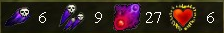

Trade Browser

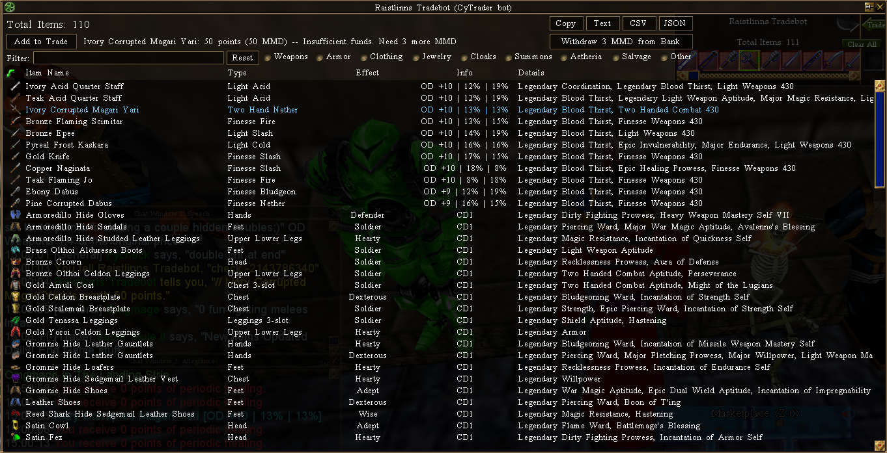

Status HUD

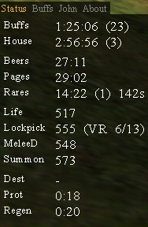

Buffs

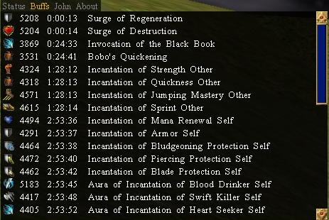

Nearby

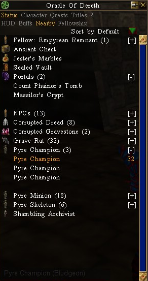

Fellowship

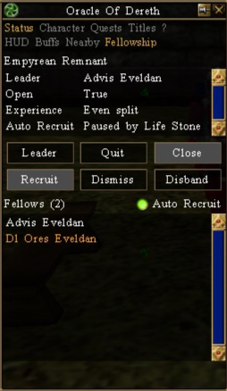

Items

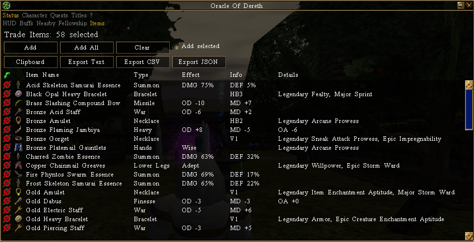

Augmentations

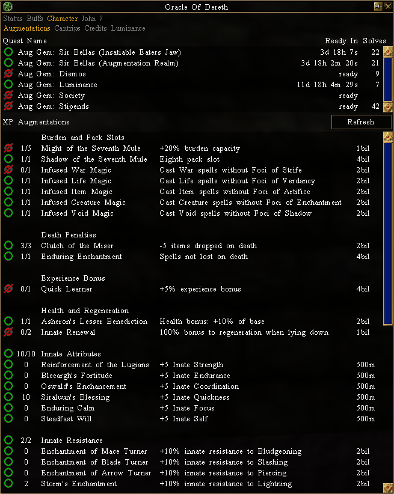

Cantrips

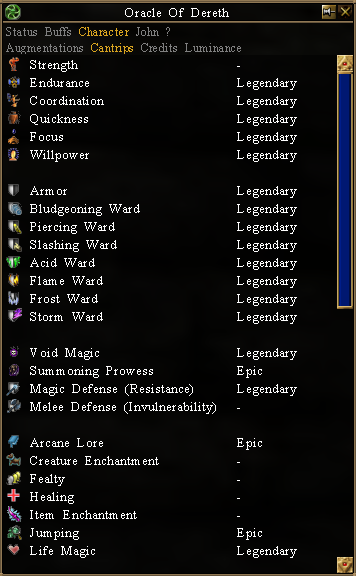

Credits

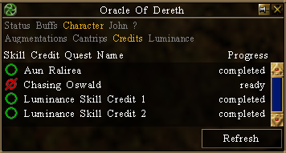

Luminance

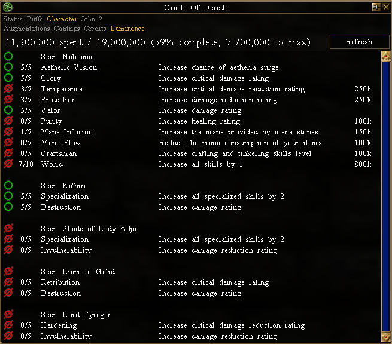

Recalls

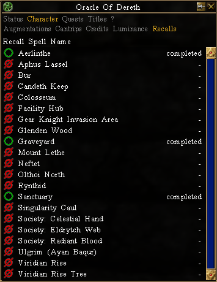

Society

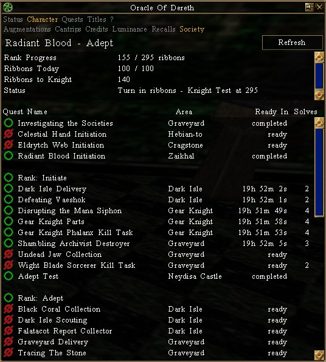

Quest Flags

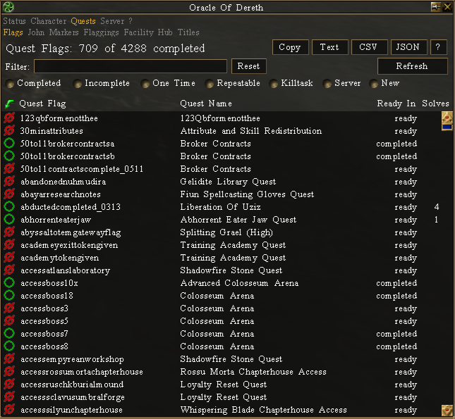

John Tracker

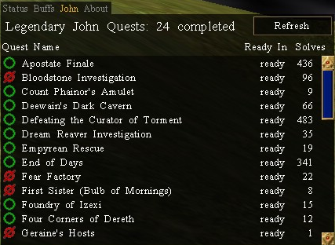

Exploration Markers

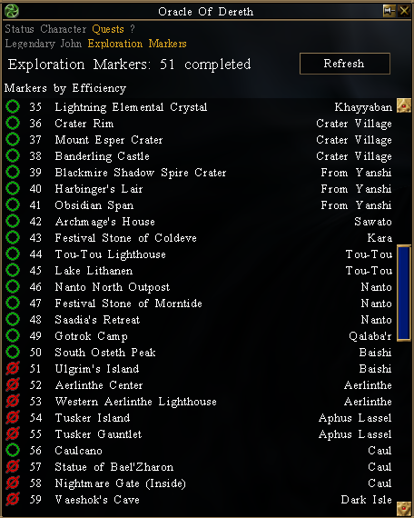

Facility Hub

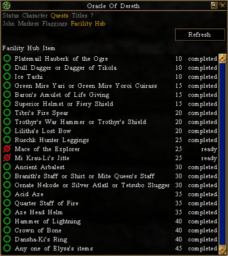

Flagging quests

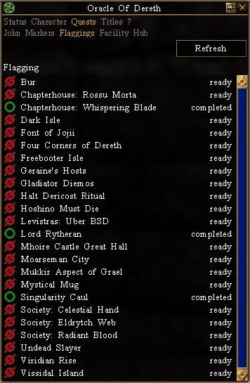

Titles

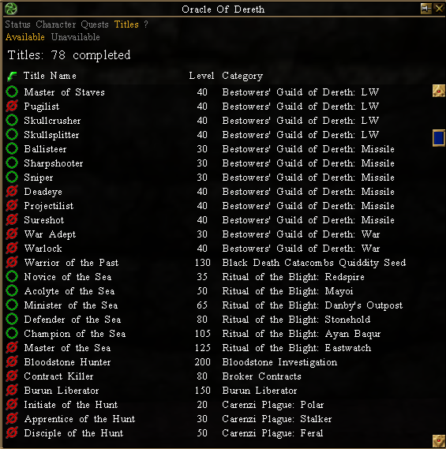

Summon Score

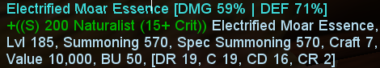

Weapon Score

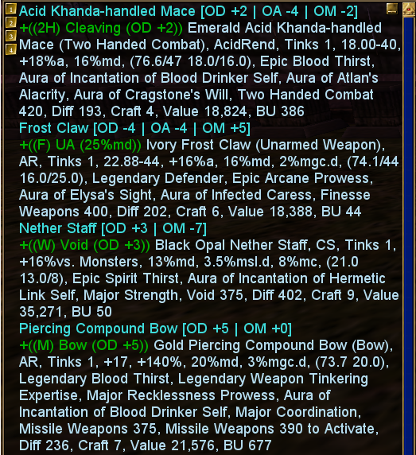

Conquest Augs

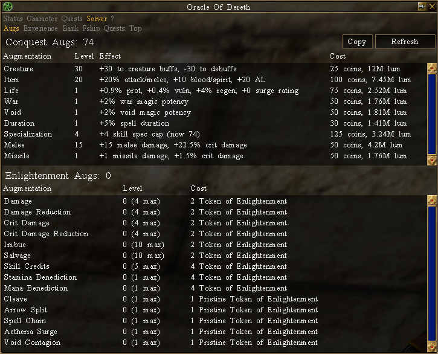

Bank

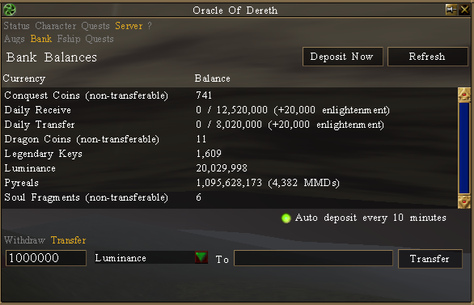

Fship List

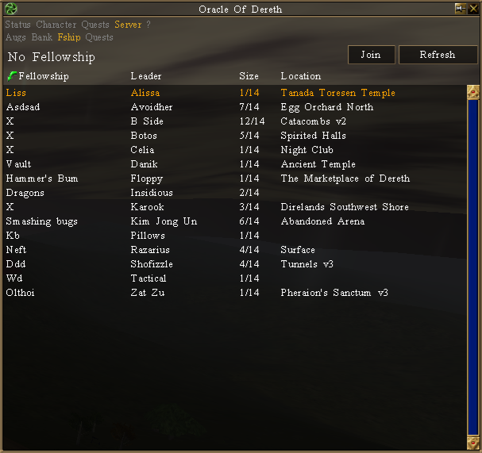

## Quest Directions and Wiki URLs

Click on a row's quest name to think the directions to yourself. Or the completed/uncompleted icon to think the wiki URL.

These actions will copy to windows clipboard by default. This can be disabled on the settings screen.

Hold CTRL + click to output to /cg

Hold ALT + click to output to /a

Hold SHIFT + click to output to /f

## Details

This plugin does a lot.

### Status HUD

The HUD displays at a glance buff timers and skill level information.

This screen cannot be configured.

It will:

- Display the time remaining on your Buffs, House Buffs, Beers, Pages and Rares.
- Display your current Lockpick, Life, MeleeD and Summon skill.
- Display how many Viridian Essences are required to complete a Viridian Rise level at your current lockpick skill.
- Display your Destruction, Protection and Regen aetheria procs.

### Buffs List

Displays your buffs and debuffs with time remaining.

### Nearby List

- Displays all nearby WorldObjects, grouped by name. 
- Click to select the closest one.
- Sort by default (objectclass), name or distance.

### Fellowship

- Create a fellowship in one click with a fantasy sounding name
- AutoRecruit will send a fellowship recruit to any players in range
- Pauses around lifestones and bindstones.

### Items

- Add selected items to list.
- Add all character items to list.
- Sort by name, info, details, spells.
- Export to clipboard, text, csv and json

### XP Augmentations

- Displays your character's Blank Augmentation Gem quest timers
- Displays your character's XP Augmentations

- A green icon means you've achieved this augmentation.
- A red icon means you haven't yet earned this augmentation.

### Luminance Augmentations

Displays your character's Luminance Augmentations
Displays amount of luminance spent, remaining, and % to max.

### Recall Spells

Displays your known recall spells.

### Cantrips List

- Displays minor / moderate / epic / legendary for every cantrip. 
- Displays suit set bonuses.
- Displays Essence Glutton and Warrior's Vitality

Only displays cantrips for skills that you have known.

### Quest Flags

Displays your /myquests cross-referenced with every quest flag the plugin knows about, in one searchable list — the raw database behind the curated tabs below.

- A green icon means your character holds that flag. A red icon means it has never been completed.
- Ready In shows `completed` for a one-time quest, or the remaining cooldown for a repeatable one.
- Filter by flag or quest name, and narrow by Completed / Incomplete, One Time / Repeatable, Server or New.
- New means the server reported a flag that isn't in the plugin's master list yet. Please send those along to Advis Eveldan so they can be added.

Click the quest icon to /think the wiki url to yourself. Click the flag or name for its quest notes. Click Ready In or Solves to print the raw quest flag data to chat.

Click any column header to sort by it; click again to reverse.

The Copy / Text / CSV / JSON buttons export whatever the filter is currently showing.

Unlike the hand-curated lists elsewhere in the plugin, this one was assembled with AI assistance and may contain errors.

### John Tracker

Displays how many legendary quests you've completed in this round of a [John](https://acportalstorm.com/wiki/John) 30 [Legendary Quests](https://acportalstorm.com/wiki/Legendary_Quests) cycle.

- A green icon means the quest has already been completed in the current John cycle. It's already counted towards your total.
- A red icon means the quest is available. Completing it will bring you 1 step closer to your goal of 30.

Displayed as well is each quest's individual quest timer and number of solves.

Click the quest icon to /think the wiki url to yourself, and copy it to the Windows clipboard.
Click the quest name to /think some handy quest notes to yourself. Use alongside GoArrow to always known the next step.

Click the Refresh button will run /myquests and refresh the quest data.

### Exploration Markers

Have you ever run the [100 Exploration Markers](https://acportalstorm.com/wiki/Dereth_Exploration/Markers_by_Efficiency) only to get to the end and realize you missed one? But which one?!?!

This plugin will display which markers you have completed and guide you to the next one.

### Facility Hub

Displays which facility hub items you've turned in.

### Flagging quests

Displays which major flagging quests you've completed.

### Society

Displays your society, number of ribbons to next rank, number of ribbons today, and available quests.

### Titles Tracker

Displays the titles you've completed.

### Trade Browser

Automatically displays whenever you open a trade window with another player or bot.

- Smart Search & Sort: Displays a searchable, sortable list of items currently in the trade window.

- Persistent ID Queue: Identifies items using a background priority queue and saves the item identification data between trades to minimize lag.

- Trade Bot Automation: Intended to work alongside the [CyTrader](https://gitlab.com/Cyprias/cytrader) bot (no affiliation). When browsing a compatible bot, the plugin will automatically calculate points per item, add items to the trade window, and balance the transaction with the correct number of MMDs (Trade Notes).

Important: Oracle of Dereth cannot automatically complete transactions. For safety, the player must always manually click the "Trade" button to finalize any deal.

### Void Target View

Only visible for characters with Void Magic.

Intended to work alongside the amazing [Target HUD](https://www.accpp.net/archive/922b4feec61670a97ef5b965092c709d) plugin (no affiliation).

Displays a target view that tracks your Corruption, Corrosion and Destructive Curse spells on each target. As well as your destruction aetheria proc.

It only tracks your own void spells, and will not display other void mage's spells.

The Corruption blast spell is tracked on 1 target only and is not aware of any splash damage targets.

If your dot was cast with the destruction proc up, it will be displayed in highlighted color.

Works for PK and PKLite.

### Summon Score

Displays a damage score and a defense score when you identify a Summons. 0% - 100%

### Weapon Score

Displays an O(Damage), O(Attack), O(Melee) based on the max rolls of the weapon

### Conquest Augs

Displays advanced augmentations, costs, xp calculations and quest bonuses for players on the ConquestAC server.

### Bank

Displays your bank balance.  Auto deposit every 10 minutes. Withdraw and transfer funds.

### Fship list

Works with the `/fship list` command to browse and join server fellowships.

### Top

Works with the `/top` command to browse the server leaderboards. One sub-tab per board — Augs,
Deaths, Enlightens, Level, Luminance, Pyreals, Quests and Titles — each ranking the players by
that total. Boards refresh when you open them (at most once every five minutes) or on demand
with the Refresh button.

### Commands

Type `/ood` to print the version number.

Type `/myquests` to manually refresh the John tracker.

Type `/od questflag` when selecting an NPC to lookup their quest flag info.

## Technicals

This plugin builds against .NET Framework 4.8 and uses VirindiViewService.

## License

MIT

## Contact

Please reach out to Advis Eveldan on the [Levistras Discord](https://discord.gg/VwbWHskR) with any feedback or bugs