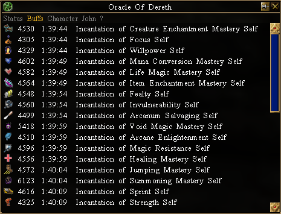
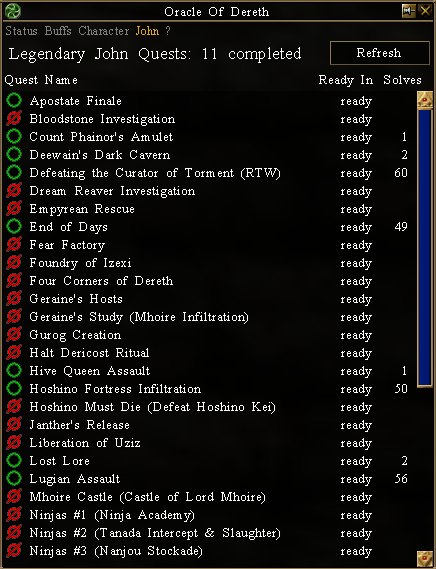

# Oracle Of Dereth

Download the latest version: [Download Oracle of Dereth](https://github.com/advis61/OracleOfDereth/releases/download/1.2.0/OracleOfDerethInstaller-1.2.0.0.exe)

## About

An [Asheron's Call](https://emulator.ac/how-to-play/) [Decal](https://decaldev.com/) v2.9.8.3 plugin.

Status HUD

Buffs List

John Tracker

## Getting Started
- This plugin requires the latest Decal, v2.9.8.3. It will fail to register in previous versions.

- Download the latest version: [Oracle of Dereth Latest Version 1.2.0](https://github.com/advis61/OracleOfDereth/releases/download/1.2.0/OracleOfDerethInstaller-1.2.0.0.exe).

- Run the .exe program.

- If the "Windows protected your PC" message appears, click on More info near the top-left corner of the window and select Run anyway.

- Complete the installer.

- It should automatically appear in the Decal list of plugins. You're all done!

## Usage

There are 3 main areas: the Status HUD, Buffs List and John Tracker.

### Status HUD

The HUD displays at a glance buff timers and skill level information.

This screen cannot be configured.

It will:

- Display the time remaining on your Buffs, House Buffs, Beers, Pages and Rares.
- Display your current Lockpick, Life, MeleeD and Summon skill.
- Display how many Viridian Essences are required to complete a Viridian Rise level at your current lockpick skill.
- Display your Destruction, Protection and Regen aetheria procs.

### Buffs List

Displays your buffs and debuffs with time remaining.

### John Tracker

Displays how many legendary quests you've completed in this round of a [John](https://acportalstorm.com/wiki/John) 30 [Legendary Quests](https://acportalstorm.com/wiki/Legendary_Quests) cycle.

- A green icon means the quest has already been completed in the current John cycle. It's already counted towards your total.
- A red icon means the quest is available. Completing it will bring you 1 step closer to your goal of 30.

Displayed as well is each quest's individual quest timer and number of solves.

Click the quest icon to /think the wiki url to yourself, and copy it to the Windows clipboard.
Click the quest name to /think some handy quest notes to yourself. Use alongside GoArrow to always known the next step.

Click the Refresh button will run /myquests and refresh the quest data.

### Commands

Type `/ood` to print the version number.
Type `/myquests` to manually refresh the John tracker.

## Technicals

This plugin builds against .NET Framework 4.8 and uses VirindiViewService.

## License

MIT

## Contact

Please reach out to Advis Eveldan on the [Levistras Discord](https://discord.gg/VwbWHskR) with any feedback or bugs